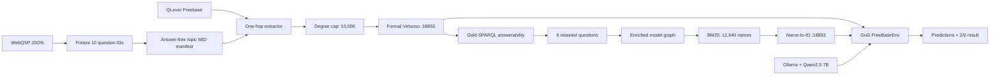
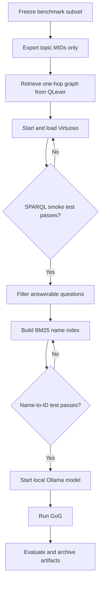
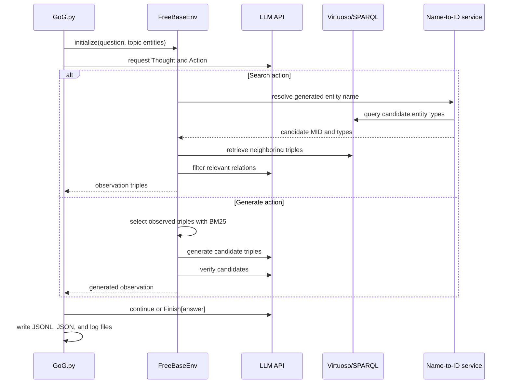
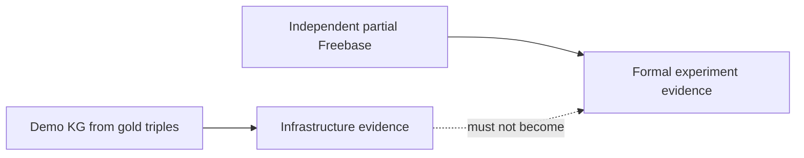
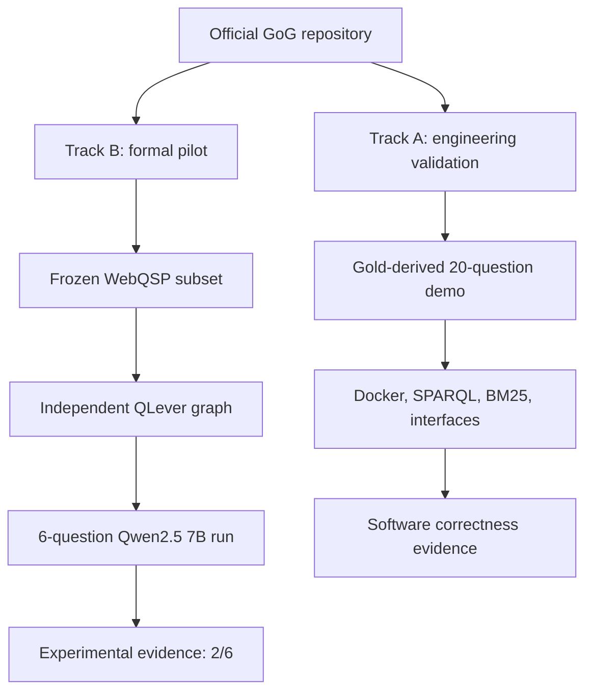

# Engineering Architecture

## System Components

## Reproduction Workflow

## GoG Runtime Sequence

## Source-Code Mapping

| Concern | Upstream file | Local engineering addition |
|---|---|---|
| Main agent loop | `src/GoG.py` | partial benchmark CLI command |
| Search and generation | `src/environment.py` | unchanged |
| Freebase access | `src/kb_interface/freebase_func.py` | Dockerized Virtuoso |
| Entity linking | `src/bm25_name2ids.py` | small-graph BM25 builder |
| LLM access | `src/llms/interface.py` | `.env.example` |
| Dataset preparation | upstream processed JSON | seed and answerability scripts |
| KG deployment | upstream manual setup | Docker Compose |
| Run documentation | upstream README | `RUN_PARTIAL.md` |
| Formal graph extraction | not provided | QLever one-hop extractor |
| Resource control | not provided | answer-independent degree cap |
| Local model runtime | OpenAI API assumed | Ollama + Qwen2.5 7B |
| Evaluation robustness | `src/evaluate.py` | zero-division fix and metric audit |

## Artifact Boundaries

The demo path proves that services and interfaces work. Only the independent
partial-Freebase path can support a reported model score.

## Dual-Track Reproduction

