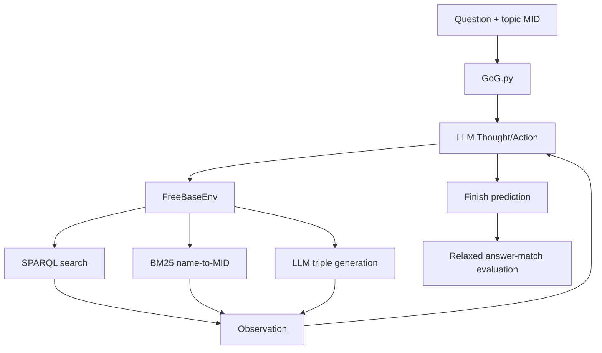

# GoG Code Structure Analysis

## Runtime entry point

`src/GoG.py` loads the selected benchmark, creates one `FreeBaseEnv` per
question, asks the LLM for interleaved Thought and Action steps, and writes the
prediction trace. Its three effective actions are `Search`, `Generate`, and
`Finish`.

## Environment and tool execution

`src/environment.py` implements the agent environment. `Search` retrieves graph
relations and neighboring entities. `Generate` asks the LLM to propose missing
triples from the current reasoning context. Entity names generated by the LLM
are resolved back to Freebase MIDs through the BM25 service.

## Knowledge graph interface

`src/kb_interface/freebase_func.py` translates environment operations into
SPARQL queries. The upstream implementation expects `SPARQLPATH` to point to a
running Freebase endpoint; the local work supplies this endpoint through
Dockerized Virtuoso.

## Entity linking

`src/bm25_name2ids.py` maps names to candidate MIDs and queries entity types.
The reimplementation adds environment-variable configuration for the graph,
pickle, and port so the demo and formal tracks can run without overwriting one
another.

## LLM interface

`src/llms/interface.py` wraps an OpenAI-compatible chat-completion endpoint.
The upstream environment installed OpenAI 0.27.9 while the source used the
OpenAI 1.x client. A compatibility layer was added so the same code can call
either client generation and can use Ollama's `/v1` endpoint.

## Evaluation

`src/evaluate.py` joins predictions and gold answer labels. Two technical
observations matter:

1. the original summary code divided by zero when no generated or fallback
   examples existed;
2. the function called `exact_match` accepts substring containment and is
   therefore a relaxed answer-match metric.

The seminar reports the implemented metric rather than silently relabeling it
as strict exact match.

## Engineering additions

The following additions describe the experimental checkout. Reusable source
files are published under `gog_partial_setup/` and `gog_formal_setup/`.
Generated graphs, model volumes, and Virtuoso database files are excluded.

| Addition | Purpose |
|---|---|
| `Makefile.partial` | deterministic engineering demo |
| `Makefile.formal` | isolated scientific pilot workflow |
| `extract_qlever_freebase.py` | answer-free one-hop graph extraction |
| `apply_degree_cap.py` | resource rule independent of gold answers |
| `check_answerability.py` | strict gold-SPARQL retention after construction |
| `build_bm25_partial.py` | graph-specific entity-linking index |
| `summarize_results.py` | hashes, per-question results, and metric evidence |

The reproducible procedure is documented in the
[partial setup guide](Partial%20Setup%20Guide.md) and
[formal pilot guide](Formal%20Pilot%20Guide.md). The official GoG source code
remains available from [YaooXu/GoG](https://github.com/YaooXu/GoG).

## Data-flow summary

